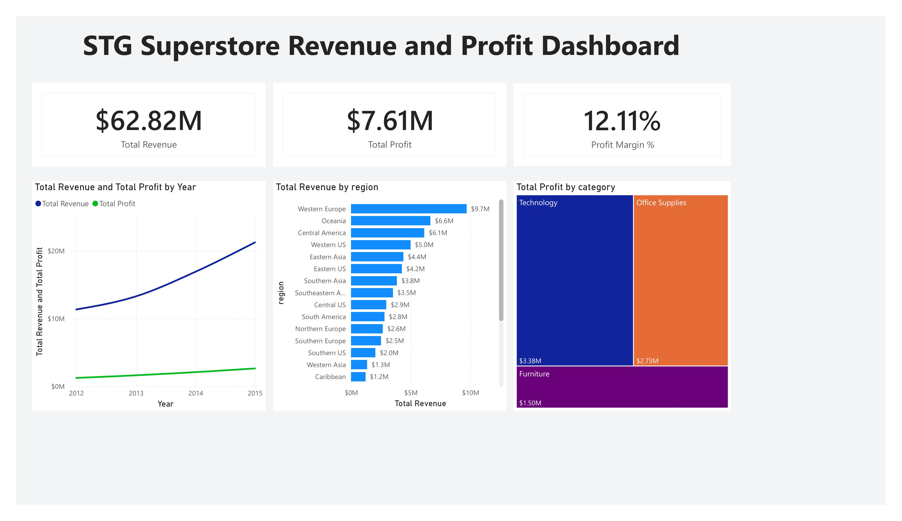

# Project 01: Executive Sales Dashboard

## 📄 Business Scenario
Corporate executives require clear visibility into high-level financial health to drive strategic decisions. This project addresses the challenge of transforming raw transactional sales records into scannable executive insights, focusing on revenue trajectories, profit margins, and regional performance.

## 🗢 Data Architecture & Schema
* **Source Engine:** Cloud-hosted Supabase PostgreSQL database.
* **Pipeline:** Live connection via an optimized ODBC DSN directly into Power BI Desktop.
* **Data Model:** Clean Star Schema optimization (Fact table linked to dimension tables).
  * `fact_sales` connected to `dim_date`, `dim_customer`, and `dim_product`.

## 📐 Key Analytical DAX Metrics
* **Total Revenue:** Gross transactional sales value aggregated across the filtered time context.
* **Total Profit:** Net revenue margins after subtracting cost of goods sold.
* **Profit Margin %:** Percentage efficiency metric calculated dynamically using `DIVIDE` functions.

## 📊 Visual Insights
* **Executive Scorecard:** High-level KPI cards reporting absolute sales health at a glance.
* **Performance Matrix:** Slices sales velocity across distinct product lines and client locations to spot hidden revenue leaks.
