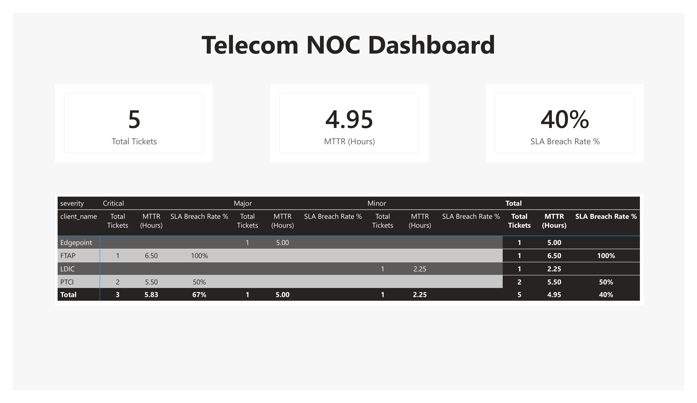

# Project 03: Telecom Network Operations Center (NOC) Dashboard

## 📄 Business Scenario
In telecommunications operations, network availability directly impacts client retention. Managing operational performance requires tracking incident volumes, response velocities, and contract penalties resulting from Service Level Agreement (SLA) breaches across major telecom portfolios (including PTCI, FTAP, LDIC, and Edgepoint).

## 🗢 Data Architecture & Schema
* **Staging Table:** `staging_noc_tickets` hosted on Supabase PostgreSQL.
* **Fields Modelled:** Incident IDs, site identifiers, regional tags, asset severities, creation/resolution timestamps, and contract SLA hours.

## 📐 Key Analytical DAX Metrics
* **Mean Time to Repair (MTTR):** Evaluates the precise average hours elapsed between incident generation and field resolution using `AVERAGEX` over continuous time durations.
* **SLA Breach Rate %:** Measures the percentage of resolved infrastructure issues that exceeded contractually mandated restoration windows.

## 📊 Visual Insights
* **Portfolio Health Grid:** Breaks down incident counts, MTTR, and breach percentages side-by-side by client portfolio.
* **Severity Matrix:** Highlights that critical faults present the greatest risk of contract penalties, enabling leadership to optimize dispatch strategies.
