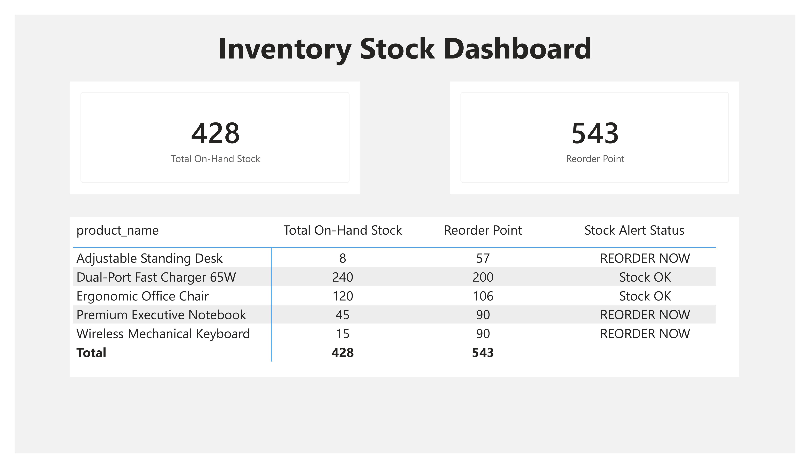

# Project 04: Supply Chain & Inventory Control

## 📄 Business Scenario
Improper warehouse management traps vital working capital in dead stock or exposes the business to severe out-of-stock deficits. This project implements logistical guardrails to track on-hand counts, monitor lead times, and optimize replenishment cycles.

## 🗢 Data Architecture & Schema
* **Staging Table:** `staging_inventory_stock` hosted on Supabase PostgreSQL.
* **Tracking Attributes:** On-hand quantities, safety buffers, average daily sales velocity, and supplier fulfillment lead times.

## 📐 Key Analytical DAX Metrics
* **Total On-Hand Stock:** Real-time inventory footprint aggregation.
* **Reorder Point (ROP):** Calculates the exact stock floor triggering fresh supplier orders based on the equation: 
  $$\text{ROP} = (\text{Daily Lead Demand} \times \text{Supplier Lead Time Days}) + \text{Minimum Required Stock}$$
* **Stock Alert Status:** A dynamic row-level evaluation flagging active shortages with automated "⚠️ REORDER NOW" or "✅ Stock OK" alerts.

## 📊 Visual Insights
* **Replenishment Ledger:** A clean inventory control matrix that surfaces critical item deficits immediately, allowing logistics teams to coordinate reorders before disruptions occur.
